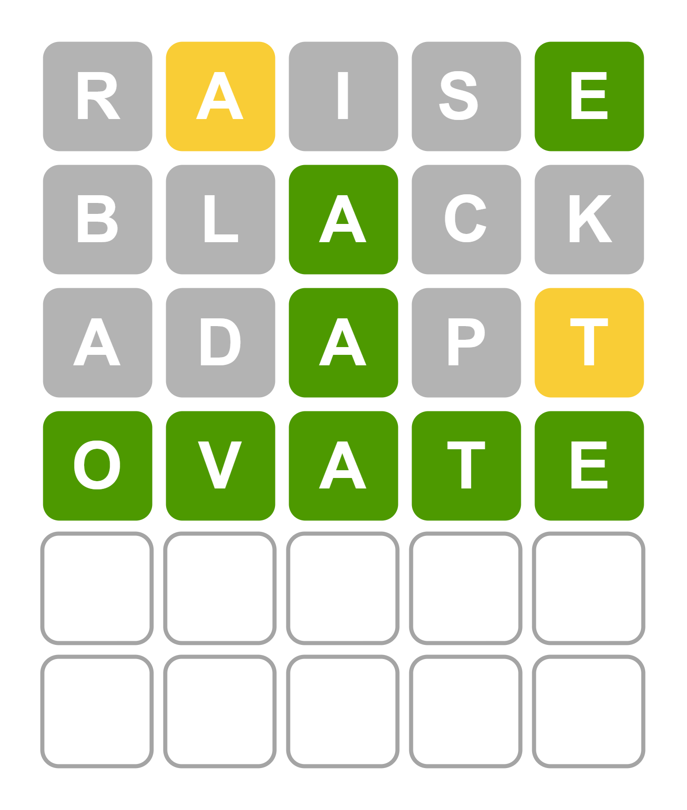

# Information-Theoretic Wordle Solver





A clean, fully client-side Wordle clone with a built-in **information-theoretic AI assistant**. No backend, no dependencies, just two files.

---

## ✨ Features

- **Classic Wordle gameplay** -- 6 attempts to guess a hidden 5-letter word
- **AI Assistant** -- powered by an information-theoretic solver that suggests the optimal next guess using candidate set partitioning
- **Statistics panel** -- tracks games played, win rate, streaks, best try, and guess distribution, persisted via `localStorage`
- **Polished UI** -- smooth flip/bounce/shake animations, colour-coded keyboard, toast notifications
- **Invalid word handling** -- unknown words are flagged and the row is flushed so you can retry without losing a turn
- **Zero dependencies** -- pure HTML, CSS, and vanilla JavaScript
- **GitHub Pages ready** -- deploy with one click, no build step required

---

## 📁 Repository Structure

```
├── index.html       # The entire game (rename wordle.html to index.html for GitHub Pages)
└── words.txt        # Word list, one 5-letter word per line
```

---

## 🚀 Getting Started

### GitHub Pages (recommended)

1. Fork or clone this repository
2. Rename `wordle.html` to `index.html`
3. Go to **Settings > Pages**, set source to `main` branch, root folder
4. Your game will be live at `https://<username>.github.io/<repo-name>/`

### Local Development

The game uses `fetch()` to load `words.txt`, so you need a local HTTP server. Opening the file directly via `file://` will not work.

**Python:**
```bash
python -m http.server 8000
# Open http://localhost:8000/index.html
```

**Node.js:**
```bash
npx serve .
```

**VS Code:**
Install the [Live Server](https://marketplace.visualstudio.com/items?itemName=ritwickdey.LiveServer) extension, then right-click `index.html` and select **Open with Live Server**.

---

## 🤖 AI Assistant

The AI button (top-right, blue) suggests the statistically optimal guess at any point in the game. The solver is a JavaScript port of `ai_assistant.py`.

### Formal Setup

Let $\mathcal{S}_t$ denote the **candidate set** at round $t$: the set of words still consistent with all feedback received so far. Initially $\mathcal{S}_1 = \mathcal{S}$ (the full vocabulary).

After submitting guess $g$ and observing feedback $y$, the candidate set is updated:

$$\mathcal{S}_{t+1} = \{ w \in \mathcal{S}_t \mid F(g, w) = y \}$$

### Step 1 -- Partitioning Function

For a given guess $g$ and candidate set $\mathcal{S}_t$, define the **feedback bucket** for outcome $y$ as:

$$C_y(g;\, \mathcal{S}_t) = \{ w \in \mathcal{S}_t \mid F(g, w) = y \}$$

where $F(g, w)$ is the Wordle feedback function (Green / Yellow / Grey per position). This partitions $\mathcal{S}_t$ across all possible outcomes $y$.

### Step 2 -- Probability of Each Partition

Under a uniform prior over candidates, the probability of observing outcome $y$ given guess $g$ is:

$$\mathbb{P}(Y = y \mid g) = \frac{|C_y(g;\, \mathcal{S}_t)|}{|\mathcal{S}_t|}$$

### Step 3 -- Expected Next Vocabulary Size

The expected size of the candidate set after one guess is:

$$\mathbb{E}\bigl[|\mathcal{S}_{t+1}| \mid g\bigr]
= \sum_y \mathbb{P}(Y = y \mid g)\, |C_y(g;\, \mathcal{S}_t)|
= \sum_y \frac{|C_y(g;\, \mathcal{S}_t)|}{|\mathcal{S}_t|} \cdot |C_y(g;\, \mathcal{S}_t)|
= \frac{1}{|\mathcal{S}_t|} \sum_y |C_y(g;\, \mathcal{S}_t)|^2$$

Since $|\mathcal{S}_t|$ is constant for a fixed round, minimising the expected next vocabulary size is equivalent to minimising:

$$\boxed{J(g;\, \mathcal{S}_t) = \sum_y |C_y(g;\, \mathcal{S}_t)|^2}$$

### Step 4 -- Guess Selection

The solver selects the guess $g^*$ that minimises the objective $J$, with worst-case bucket size $W = \max_y |C_y|$ as a tiebreaker:

$$g^* = \arg\min_{g \in \mathcal{S}} \bigl(J(g;\, \mathcal{S}_t),\; W(g;\, \mathcal{S}_t)\bigr)$$

The search is performed over the **full vocabulary** (not just remaining candidates), since a non-candidate word may partition the candidate set more efficiently.

### Implementation Note

To keep the UI responsive, the search runs in non-blocking 200-word chunks using `setTimeout`, approximating a Web Worker without requiring a separate thread.

### AI Button Usage

| Action | Result |
|--------|--------|
| Click **AI button** | Computes and shows the optimal suggestion in a banner |
| Click **Use it** | Auto-types the suggested word into the current row |
| Click **x** | Dismisses the banner; next click recomputes for the new round |
| Submit a guess | Candidate set $\mathcal{S}_{t+1}$ updates automatically |

---

## 🎮 How to Play

1. Type a 5-letter word using your keyboard or the on-screen keys
2. Press **Enter** to submit
3. Tiles change colour to show how close your guess was:

| Colour | Meaning |
|--------|---------|
| 🟩 Green | Correct letter, correct position |
| 🟨 Yellow | Correct letter, wrong position |
| ⬜ Grey | Letter not in the word |

4. Use the feedback to narrow down the answer within 6 tries

---

## 📊 Statistics

The stats panel (bar chart icon in the header) tracks:

- **Games Played** -- total games started
- **Games Won** -- total wins
- **Win Rate** -- percentage of games won
- **Best Try** -- fewest guesses used to win
- **Current Streak** -- consecutive wins
- **Max Streak** -- longest winning streak ever
- **Guess Distribution** -- bar chart of wins by guess number

Stats are saved in `localStorage` and persist across sessions. They are scoped to the origin, so GitHub Pages stats are independent of local server stats.

---

## 🛠️ Customisation

### Using a different word list

Replace `words.txt` with any plain text file containing one 5-letter word per line. Words with non-alphabetic characters or lengths other than 5 are filtered out automatically.

Update the filename constant at the top of the `<script>` block if needed:

```js
const WORD_FILE = 'words.txt'; // change this to match your filename
```

### Adjusting game parameters

```js
const MAX_GUESSES = 6;   // number of allowed attempts
const WORD_LENGTH = 5;   // letters per word
const FLIP_DELAY  = 280; // ms between tile flip animations
```

---

## 🌐 Browser Support

Works in all modern browsers (Chrome, Firefox, Safari, Edge). Requires JavaScript enabled. No installation, no accounts, no data sent anywhere.

---

## 📄 License

MIT -- free to use, modify, and distribute.


